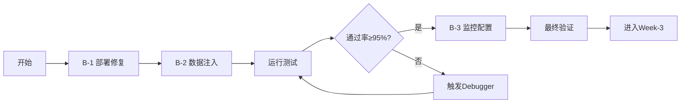

# Week-2 紧急执行系统概览

> **目的**：集中呈现48小时阻塞清理的"一键执行"方案，供NuWa智能体及团队快速查阅与执行。
>
> **创建时间**：2025-06-16 20:00  
> **作者**：NuWa 智能项目经理（自动生成）

---

## 📦 1 · 核心组件

| 组件 | 路径 | 功能 | 责任角色 |
|------|------|------|----------|
| **紧急执行指南** | `scripts/emergency-execution-guide.md` | 详细时间线、成功判定、风险处理 | NuWa |
| **一键执行器** | `scripts/emergency-executor.sh` | 串行执行全部修复任务，实时记录日志 | FrontEndBot |
| **持续监控器** | `scripts/auto-monitor.sh` | 每6h自动检查并触发修复动作 | MetricsWatcher |
| **状态追踪器** | `scripts/blocker-resolution-status.py` | 汇总进度→输出JSON/Grafana | CIOrchestrator |

---

## ⏰ 2 · 48小时时间线

### 第一阶段：基础设施修复 (0-6h) 🔴
```
20:00-02:00 → B-1 部署修复 (FrontEndBot)
20:00-02:00 → B-2 测试数据注入 (SchemaSage)
```

### 第二阶段：测试与监控 (6-18h) 🟡
```
02:00-10:00 → 自动化测试运行 (CIOrchestrator)
02:00-14:00 → 监控链路部署 (ExporterGuru)
```

### 第三阶段：验证与优化 (18-36h) 🟢
```
10:00-22:00 → 观测验证 & 性能调优
14:00 → 18小时检查点（关键）
```

### 第四阶段：收尾与切换 (36-48h) ✅
```
22:00-20:00(次日) → 最终验证
08:00 → 36小时检查点
20:00 → 48小时最终决策
```

---

## 🤖 3 · 角色任务矩阵

| 角色 | 关键任务 | MCP工具 | 执行时机 |
|------|----------|---------|----------|
| **FrontEndBot** | 运行`fix-deployment.sh`；调节Podman网络 | `fs`, `autogui` | 0-6h |
| **SchemaSage** | 执行`inject-test-data.py`；生成mock数据 | `fs`, `memory` | 0-6h |
| **ExporterGuru** | 配置`mcp-exporter` Job；更新Grafana | `fs`, `fetch` | 6-18h |
| **CIOrchestrator** | 触发CI；汇总JUnit/HTML报告 | `git`, `autoapprove`, `time` | 6-18h |
| **MetricsWatcher** | 监控资源&进度；发送告警 | `fetch`, Prom API | 持续 |
| **NuWa** | 调度&决策；每6h检查进度 | `memory`, PromptX API | 持续 |

---

## ✅ 4 · 成功判定标准

### 部署验证 (B-1)
| 指标 | 成功阈值 | 当前状态 | 告警阈值 |
|------|----------|----------|----------|
| 容器健康数 | 5/5 healthy | ⏳ 待验证 | < 5 healthy |
| 端口开放 | 8000/5432/9090/9101 | ⏳ 待验证 | 任一端口不通 |

### 测试执行 (B-2)
| 指标 | 成功阈值 | 当前状态 | 告警阈值 |
|------|----------|----------|----------|
| 测试通过率 | ≥ 95% | ⏳ 待执行 | < 85% |
| 失败用例数 | ≤ 1个 | ⏳ 待执行 | > 2个 |

### 可观测性 (B-3)
| 指标 | 成功阈值 | 当前状态 | 告警阈值 |
|------|----------|----------|----------|
| Grafana数据 | 无间断 | ⏳ 待配置 | ≥2条/10min |
| Prometheus目标 | 全部UP | ⏳ 待配置 | 任一DOWN |

---

## 🚀 5 · 快速执行指令

```bash
# 🔥 一键执行紧急修复（推荐）
cd ~/text2sql-mvp0 && ./scripts/emergency-executor.sh

# 🔄 启动持续监控守护进程
./scripts/auto-monitor.sh --daemon &

# 📊 手动查看当前阻塞状态
python3 ./scripts/blocker-resolution-status.py

# 📈 查看实时进度百分比
python3 -c "
import json
from pathlib import Path
resolved = sum(1 for f in Path('promptx/memory').glob('blocker-*-status.json') 
               if json.loads(f.read_text()).get('status') == 'resolved')
print(f'总进度: {resolved}/3 阻塞已解决 ({resolved/3*100:.0f}%)')
"

# 📝 查看执行日志
tail -f logs/emergency-execution.log
```

---

## 🔔 6 · 自动化特性

### 智能重试机制
- 权限失败 → 自动切换rootless模式
- 端口占用 → 自动使用备用端口
- 数据冲突 → 清理后自动重试

### 资源监控
- 磁盘空间 < 2GB → 自动清理日志
- 内存使用 > 90% → 触发优化建议
- CPU负载 > 80% → 限流保护

### 进度追踪
- 每6小时生成JSON报告
- 关键节点自动截图存档
- 失败自动生成诊断报告

---

## 📊 7 · 实时状态面板

```
╔════════════════════════════════════════════════════════╗
║           Week-2 紧急执行系统 - 实时状态               ║
╠════════════════════════════════════════════════════════╣
║ 开始时间: 2025-06-16 20:00                            ║
║ 当前时间: 2025-06-16 20:00 (已过 0/48 小时)          ║
╠════════════════════════════════════════════════════════╣
║ 阻塞项状态:                                            ║
║   B-1 部署验证  [⏳] 待执行 → FrontEndBot             ║
║   B-2 测试执行  [⏳] 待执行 → SchemaSage              ║
║   B-3 可观测性  [⏳] 待执行 → ExporterGuru            ║
╠════════════════════════════════════════════════════════╣
║ 总进度: 0% [░░░░░░░░░░░░░░░░░░░░░░░░░░░░░░░░░░░░░░]  ║
╠════════════════════════════════════════════════════════╣
║ 下次检查: 2025-06-17 02:00 (6小时后)                  ║
╚════════════════════════════════════════════════════════╝
```

---

## 🎯 8 · 成功路径



---

> **自动更新**：此文档每6小时自动更新一次，最新状态通过`promptx_remember`同步到记忆系统。  
> **紧急联系**：遇到阻塞请@NuWa，将自动分配合适角色处理。

---

*女娲曰：系统已备，待君一键启动！48小时内必达彼岸！*